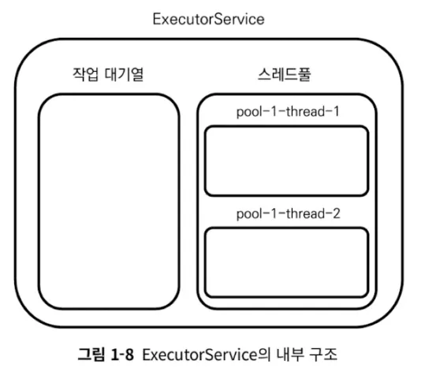
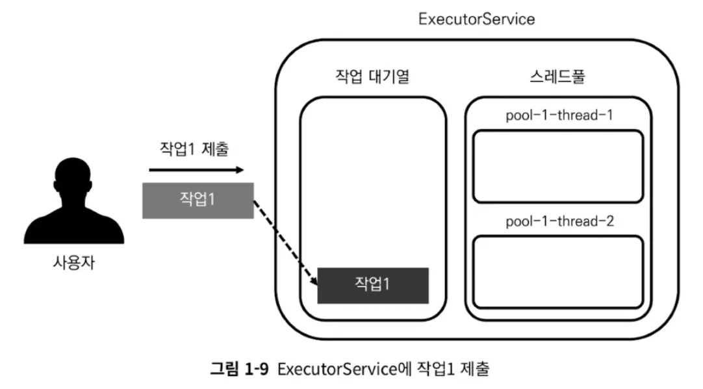
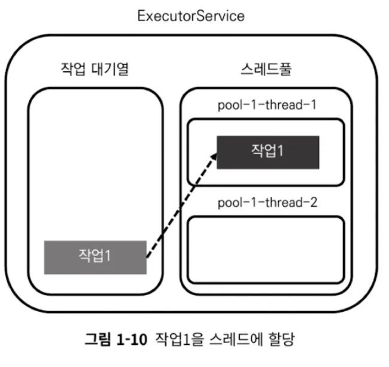
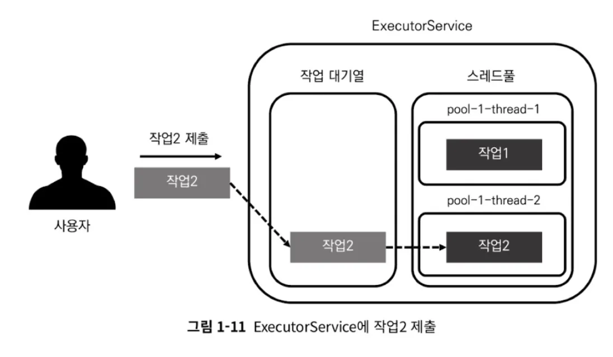
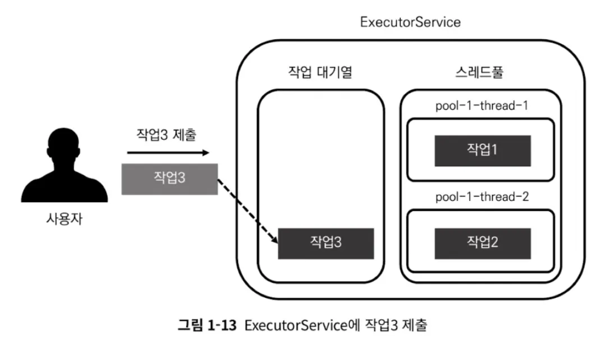
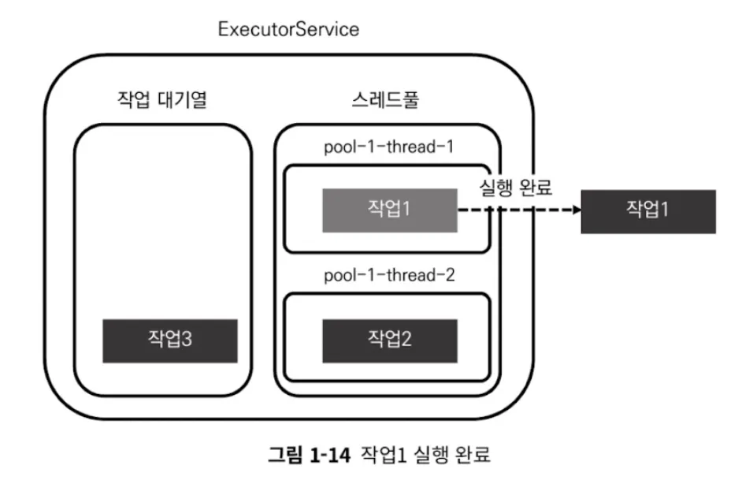
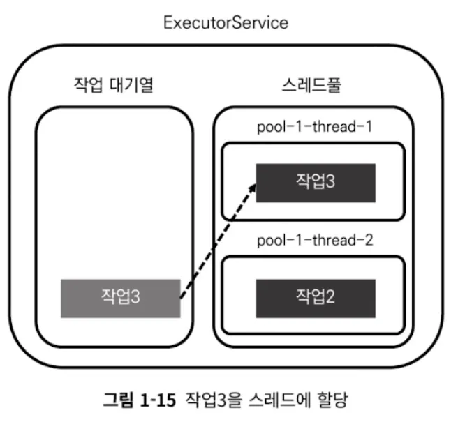
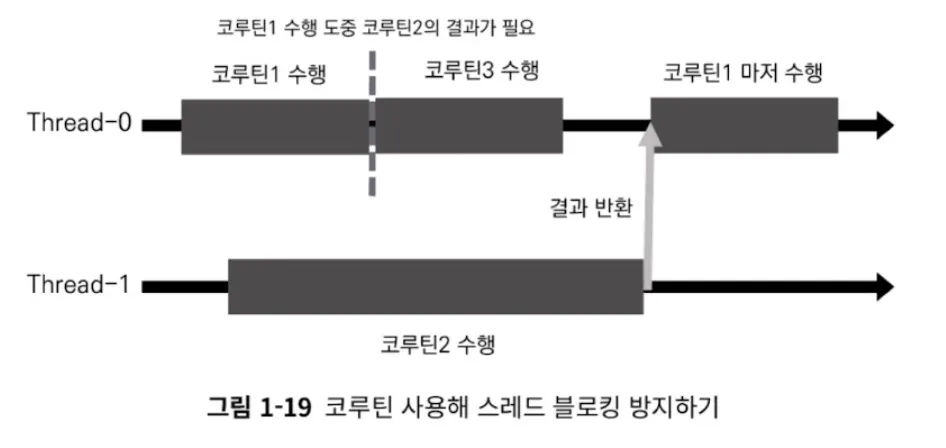

# Ch.1 스레드 기반 작업의 한계와 코루틴의 등장


> ### 📌 1장에서 다루는 내용
>
> - JVM 프로세스와 스레드에 대한 이해
> - 단일 스레드를 사용하는 것의 한계와 멀티 스레드 프로그래밍
> - 기존 멀티 스레드 프로그램의 한계와 코루틴이 이를 극복한 방법


# 1. JVM 프로세스와 스레드

- 일반적으로 main 함수를 통해 진입 → 프로세스 시작 & 메일 스레드 생성 → main 함수의 내부 코드 수행 → 모두 실행되면 종료
- JVM 프로세스는 기본적으로 메인 스레드를 단일 스레드로 실행
- 메인 스레드가 항상 프로세스의 끝을 함께하는 것은 아님 (멀티 스레드인 경우)

# 2. 단일 스레드의 한계와 멀티 스레드 프로그래밍

## 2.1 단일 스레드 애플리케이션의 한계

- 스레드는 하나의 작업을 수행할 때 다른 작업을 동시에 수행하지 못함
- 작업이 오래 걸리면 해당 작업을 수행하는 동안 다른 작업 수행 불가 → 응답성 문제
- ex. 메인 스레드만 사용하는 애플리케이션
    - 네트워크 통신 / 복잡한 연산 등 오래 걸리는 작업 → 그동안 안드로이드 애플리케이션은 UI를 그리는 작업을 멈추고 사용자 입력도 제대로 전달 못 받음 (버벅임)
- 서버사이드에서도 마찬가지

## 2.2 멀티 스레드 프로그래밍을 통한 단일 스레드의 한계 극복

- 여러 개의 스레드 사용, 각 스레드가 한 번의 하나의 작업 처리 → 여러 작업 동시에 처리 가능
- 안드로이드에서의 멀티 스레드 프로그래밍
    - 오래 걸리는 작업
        - 메인 스레드와는 다른 별도 스레드 사용
        - 백그라운드 스레드에서 처리
    - 메인 스레드에서는 UI 관련 처리
- 서버사이드
    - 오래 걸리는 작업이 요청됐을 때 독립적인 작은 작업으로 나눈 후 서로 다른 스레드에서 실행

⇒ 처리 속도가 빨라짐

# 3. 스레드, 스레드풀을 사용한 멀티 스레드 프로그래밍

## 3.1 Thread 클래스를 사용하는 방법과 한계

### Thread 클래스를 사용해 스레드 다루기

```kotlin
class ExampleThread : Thread() {
    override fun run() {
        println("[${currentThread().name}] 새로운 스레드 시작")
        sleep(2000L) // 2초 동안 대기
        println("[${currentThread().name}] 새로운 스레드 종료")
    }
}
```

```kotlin
fun main() {
    println("[${currentThread().name}] 메인 스레드 시작")
    ExampleThread().start()
    sleep(1000L)
    println("[${currentThread().name}] 메인 스레드 종료")
}
```

1. “메인 스레드 시작” 출력
2. 새로운 스레드 생성, “새로운 스레드 시작” 출력
3. 1초 뒤, “메인 스레드 종료” 출력
4. 다시 1초 뒤, “새로운 스레드 종료” 출력

### 사용자 스레드와 데몬 스레드

- 사용자 스레드: 우선도가 높은 스레드
- 데몬 스레드: 우선도가 낮은 스레드
- JVM 프로세스가 종료되는 시점: 우선도가 높은 사용자 스레드가 모두 종료될 때
- 멀티 스레드 → 스레드 중 사용자 스레드가 모두 종료되는 시점에 프로세스 종료
- Thread 클래스를 상속한 클래스를 사용해 스레드 생성 → 기본적으로 사용자 스레드로 생성
- 만약 생성되는 스레드를 데몬 스레드로 바꾸고 싶으면 `isDaemon = true` 속성 적용
    
    ```kotlin
    ExampleThread().apply {
    		isDaemon = true
    }
    ```
    

### thread 함수 사용해 새로운 스레드에서 코드 실행하기

- 코틀린은 새로운 스레드에서 실행할 코드를 쉽게 작성할 수 있도록 thread 함수 제공
- thread 함수의 람다식에 새로운 스레드에서 실행할 코드를 작성하면 새로운 스레드에서 코드가 실행됨

```kotlin
fun main() {
    println("[${currentThread().name}] 메인 스레드 시작")
    thread(isDaemon = false) {
        println("[${currentThread().name}] 새로운 스레드 시작")
        sleep(2000L)
        println("[${currentThread().name}] 새로운 스레드 종료")
    }
    sleep(1000L)
    println("[${currentThread().name}] 메인 스레드 종료")
}
```

### Thread 클래스를 직접 다루는 방법의 한계

1. Thread 클래스를 상속한 클래스를 인스턴스화해 실행할 때마다 매번 새로운 스레드가 생성됨
    - 스레드 생성 비용 비쌈 → 성능 안 좋음
2. 스레드 생성과 관리에 대한 책임이 개발자에게 있음
    - 프로그램의 복잡성 증가
    - 실수로 인해 오류나 메모리 누수 발생 가능성 증가

> - 이를 해결하려면
>     - 한 번 생성한 스레드를 간편하게 재사용할 수 있어야 함
>     - 스레드의 관리를 미리 구축한 시스템에서 책임질 수 있어야 함
> - 이런 역할을 위해 Executor 프레임워크가 만들어짐


## 3.2 Executor 프레임워크를 통해 스레드풀 사용하기

- 개발자가 스레드를 직접 관리하는 문제를 해결하고 생성된 스레드의 재사용성을 높이기 위해 등장
- 스레드 생성 및 관리에 스레드풀(Thread Pool)이란 개념 사용
- 스레드풀: 스레드의 집합 ← 여기에 스레드풀을 관리하고 사용자로부터 요청받은 작업을 각 스레드에 할당하는 시스템을 더한 것이 Executor 프레임워크
- 작업 처리를 위해 스레드풀을 미리 생성 → 작업을 요청 받으면 쉬고 있는 스레드에 작업 분배
- 이때, 작업을 끝내더라도 스레드를 종료하지 않고 다음 작업이 들어오면 재사용
- 개발자가 해야 할 일은 스레드풀에 속한 스레드의 개수를 설정 & 해당 스레드풀을 관리하는 서비스에 작업을 제출

### Executor 프레임워크 사용해보기

- 주로 사용하는 함수
    - 스레드풀 생성 & 생성된 스레드풀을 관리하는 객체를 반환받는 함수
    - 스레드풀을 관리하는 객체에 작업을 제출하는 함수

```kotlin
fun ExecutorExample() {
    val startTime = System.currentTimeMillis()
    
    // ExecutorService 생성
    val executorService: ExecutorService = Executors.newFixedThreadPool(2)
    
    // 작업1 제출
    executorService.submit {
        println("[${Thread.currentThread().name}][${getElapsedTime(startTime)}] 작업1 시작")
        Thread.sleep(1000L) // 1초간 대기
        println("[${Thread.currentThread().name}][${getElapsedTime(startTime)}] 작업1 완료")
    }
    
    // 작업2 제출
    executorService.submit {
        println("[${Thread.currentThread().name}][${getElapsedTime(startTime)}] 작업2 시작")
        Thread.sleep(1000L) // 1초간 대기
        println("[${Thread.currentThread().name}][${getElapsedTime(startTime)}] 작업2 완료")
    }
    
    executorService.shutdown()
}

fun getElapsedTime(startTime: Long): String = "지난 시간: ${System.currentTimeMillis() - startTime}ms"
```

- ExecutorService에 submit 함수를 통해 작업1과 작업2 제출
- getElapsedTime: 지난 시간 출력
- 만약 여기에 작업3을 추가하면 작업1,2가 끝난 후에 실행됨 (스레드 수를 2개로 설정했기 때문)

### ExecutorService 내부 구조와 동작



- ExecutorService 객체는 크게 두 부분
    - 할당 받은 작업을 적재하는 작업 대기열
    - 작업을 수행하는 스레드의 집합인 스레드풀
- ExecutorService 객체는 사용자로부터 요청받은 작업을 작업 대기열에 적재한 후 쉬고 있는 스레드에 작업 할당



- 작업 대기열에 들어간 작업1은 스레드로 할당되길 기다림
- 쉬고 있는 스레드가 있으면 할당됨





- 사용자가 작업3을 추가로 요청 → 작업 대기열에 적재



- 스레드풀의 스레드 중 하나가 작업을 완료 → 작업3을 쉬고 있는 스레드에 분배





- 중요한 점은 개발자가 ExecutorService 객체 내부의 동작을 전혀 신경 쓰지 않아도 됨

### Executor 프레임워크의 의의와 한계

- 개발자가 더 이상 스레드를 직접 관리하지 않고 스레드의 재사용을 편하게 할 수 있다는 점에서 혁신적
- 스레드 블로킹 문제
    - 스레드가 아무것도 하지 못하고 사용될 수 없는 상태에 있는 것 → 스레드의 사용을 막음
    - 스레드는 비싼 자원 → 사용될 수 없는 상태에 놓이는 것이 반복되면 애플리케이션의 성능이 떨어짐
    - 원인은 다양
        - 여러 스레드가 동기화 블록에 동시에 접근하는 경우 하나의 스레드만 동기화 블록에 접근이 허용
        - 뮤텍스나 세마포어로 인해 공유되는 자원에 접근할 수 있는 스레드가 제한되는 경우
    - ex. ExecutorService 객체에 제출한 작업에서 결과를 전달받을 때
        - 언젠가 올지 모르는 값을 기다리는 데 Future 객체를 사용해야 함
        - Future 객체는 미래에 언제 올지 모르는 값을 기다리는 get 함수 갖고 있음
        - get 함수를 호출하면 get 함수를 호출한 스레드가 결괏값이 반환될 때까지 블로킹 됨
        
        ```kotlin
        fun ThreadBlocking() {
            val executorService: ExecutorService = Executors.newFixedThreadPool(2)
            val future: Future<String> = executorService.submit<String> {
                Thread.sleep(2000)
                return@submit "작업1 완료"
            }
        
            val result = future.get()
            println(result)
            executorService.shutdown()
        }
        ```
        
        - ExecutorService 객체를 생성한 후 문자열을 반환받는 작업을 제출
        - Future 객체: 미래에 값이 반환되는 것을 기다리기 위한 객체
        - Future 객체의 get 함수를 호출하면 호출한 스레드는 Future 객체가 결괏값을 반환할 때까지 스레드를 블로킹하며 결과를 기다림
    - 스레드 블로킹을 일으키는 가장 대표적인 함수: Thread.sleep

## 3.3 이후의 멀티 스레드 프로그래밍과 한계

- 이후, 기존 문제를 보완하기 위한 다양한 방법 만들어짐
- Java1.8: CompletableFutre 객체 (스레드 블로킹을 줄이고 작업을 체이닝하는 기능을 제공)
- RxJava: 리액티브 프로그래밍 패러다임을 지원 → 결괏값을 데이터 스트림으로 처리 → 블로킹 방지 & 작업이 실행되는 스레드풀을 손쉽게 전환

# 4. 기존 멀티 스레드 프로그래밍의 한계와 코루틴

## 4.1 기존 멀티 스레드 프로그래밍의 한계

- 스레드 기반으로 작업한다는 한계
    - 스레드는 생성 비용 & 작업 전환 비용이 비쌈
    - 만약 스레드가 아무 작업을 하지 못하고 기다려야 하면 컴퓨터 자원 낭비
    - 스레드 블로킹은 스레드 기반 작업을 하는 멀티 스레드 프로그래밍에서 피할 수 없는 문제
    - 간단한 작업에서는 콜백을 사용하거나 체이닝 함수를 사용하는 등의 방법을 통해 스레드 블로킹을 피할 수 있음
        - 체이닝 함수: 한 함수의 결과를 바로 다른 함수로 연결해 호출하는 데 사용
            - 함수가 실행 완료됐을 때 실행할 콜백을 등록
            - ex. CompletableFutrue
                
                ```kotlin
                fun CompletableFutureExample() {
                    val startTime = System.currentTimeMillis()
                    val executor = Executors.newFixedThreadPool(2)
                
                    // CompletableFutre 생성 및 비동기 작업 실행
                    val completableFuture = CompletableFuture.supplyAsync({
                        Thread.sleep(1000L) // 1초간 대기
                        return@supplyAsync "결과" // 결과 반환
                    }, executor)
                
                    // 비동기 작업 완료 후 결과 처리를 위한 체이닝 함수 등록
                    completableFuture.thenAccept { result ->
                        println("[${getElapsedTime(startTime)}] $result 처리")    // 결과 처리 출력
                    }
                
                    // 비동기 작업 실행 도중 다른 작업 실행
                    println("[${getElapsedTime(startTime)}] 다른 작업 실행")
                
                    executor.shutdown()
                }
                ```
                
                - CompletableFuture 객체를 반환받기 위해서는 작업을 제출할 때 ExecutorService 객체의 Submit 함수 대신 `CompletableFuture.supplyAsync` 함수를 사용해야 함
                - `CompletableFuture.supplyAsync` 첫 번재 매개변수: 실행할 코드가 람다식으로 전달, 두 번재 매개변수: 해당 작업이 실행될 ExecutorService 객체 지정
                - CompletableFutre 객체에 결과가 반환됐을 때 실행할 콜백 `thenAccept` 함수를 통해 등록
                - Future 객체의 get 함수는 스레드를 블로킹하고 결과를 기다리지만, CompletableFuture 객체의 thenAccept 함수는 스레드를 블로킹하지 않고 completableFuture 객체에 콜백 등록
    - 작업이 많아지고 작업 간의 종속성이 복잡해질수록 스레드 블로킹을 피하기가 어렵고 만들어진 스레드가 성능을 제대로 발휘하지 못하는 경우가 자주 발생
    - 실제로 애플리케이션은 작업 간의 종속성이 매우 복잡하고 네트워크 작업을 수없이 수행 → 스레드 블로킹이 발생하는 것은 필연적

## 4.2 코루틴은 스레드 블로킹 문제를 어떻게 극복하는가?

- 코루틴은 작업 단위 코루틴을 통해 스레드 블로킹 문제를 해결
- 작업 단위 코루틴: 스레드에서 작업 실행 도중 일시 중단할 수 있는 작업 단위
    - 코루틴은 작업이 일시 중단되면 더 이상 스레드 사용이 필요하지 않으므로 스레드 사용 권한 양보
    - 일시 중단된 코루틴은 재개 시점에 다시 스레드에 할당됨
- 코루틴이 경량 스레드라고 불리는 이유
    - 프로그래머가 코루틴을 만들어 코루틴 스캐줄러에 넘김
    - 코루틴 스케줄러는 자신이 사용할 수 있는 스레드나 스레드풀에 해당 코루틴을 분배해 작업 수행
    - 코루틴이 스레드를 사용하던 중에 필요가 없어지면 해당 스레드를 다른 코루틴이 쓸 수 있게 양보 → 블로킹 X
- ex. 스레드 2개, 코루틴 3개
    
    
    
- 코루틴은 작업 단위로서, 자신이 스레드를 사용하지 않을 때 스레드 사용 권한 반납 → 스레드 사용 최적화, 스레드가 블로킹되는 상황 방지
- 코루틴은 스레드에 비해 생성과 전환 비용이 적음
    - 스레드에 자유롭게 뗐다 붙였다 할 수 있음 → 작업 생성, 전환에 필요한 리소스와 시간이 줄어듦
- 구조화된 동시성을 통해 비동기 작업을 안전하게 만듦
- 예외 처리를 효과적으로 처리
- 코루틴이 실행 중인 스레드를 손쉽게 전환할 수 있도록 함